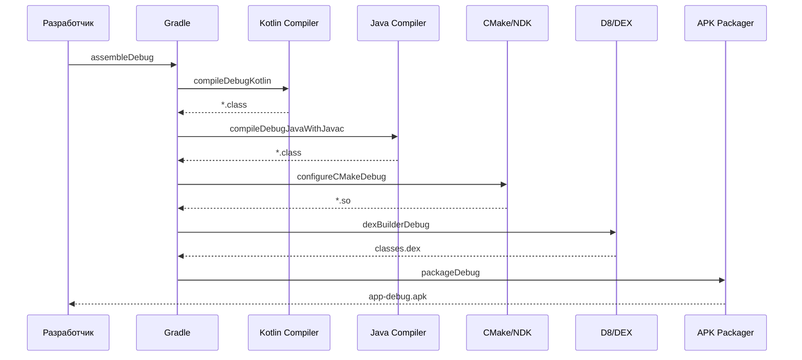

# Архитектура Winlator CMOD (REF4IK)

> **Дата обзора**: 2026-07-05  
> **Dev Team**: Nova (Frontend) + Sage (Backend) + Milo (Visual)  
> **Версия**: 7.1.4x-cmod (versionCode 20)  
> **Пакет**: `com.winlator.cmod`

---

## 1. ОПИСАНИЕ ПРОЕКТА

**Winlator CMOD** — Android-приложение для запуска Windows (x86_64) приложений и игр на Android-устройствах. Использует стэк: Wine (трансляция Win32 API → POSIX) + Box86/Box64 (эмуляция x86 на ARM) + собственный X11-сервер + Vulkan/OpenGL рендеринг.

Это модифицированная версия (ref4ik mod) на базе оригинального Winlator от brunodev85, объединяющая лучшие наработки из:
- **Winlator Bionic** (Pipetto-crypto) — GLIBC-based окружение
- **Winlator Cmod** (Coffincolors) — дополнительные фичи
- **WinNative** — нативная эмуляция Windows-приложений
- **GameNative** — Vulkan game rendering layer

### Ключевые возможности
- 🎮 Запуск Windows-игр на Android (через Wine)
- 🖥️ Полноценный X11-сервер на Java (кастомная реализация)
- 🎨 Vulkan + OpenGL ES рендеринг (через DXVK/VKD3D)
- 🔥 LSFG (Lossless Scaling Frame Generation) — генерация кадров
- 🌐 Steam интеграция — библиотека, логин, загрузка, облачные сохранения
- 🎯 Поддержка внешних геймпадов и кастомных профилей управления
- 👓 VR/XR через OpenXR (Oculus Quest, Pico и др.)
- ⚡ Adrenotools для максимальной производительности на Adreno GPU

---

## 2. ТЕХНИЧЕСКИЙ СТЕК

### Платформа
| Параметр | Значение |
|----------|----------|
| **Языки** | Kotlin 2.2.21 + Java 17 + C/C++ (NDK) |
| **minSdk** | 26 (Android 8.0) |
| **targetSdk** | 28 (Android 9) — осознанное ограничение для совместимости с Wine |
| **compileSdk** | 34 (Android 14) |
| **AGP** | 8.1.1 |
| **NDK** | 27.0.12077973 |
| **Архитектура** | только arm64-v8a |
| **Сборка** | Gradle + CMake + glslangValidator (SPIR-V) |
| **Подпись** | debug-modern.jks (debug), release не настроен |

### Фреймворки и библиотеки

#### UI (Compose + ViewSystem)
- Jetpack Compose BOM 2025.02.00
- Material 3 (Material Design You)
- Navigation Component (fragments + compose)
- Coil 2.7.0 (image loading, GIF/WebP)
- Glide 4.11.0 (legacy)
- Room 2.8.4 (Steam database)

#### Network
- Retrofit 2.9.0 + OkHttp 4.9.3
- Gson 2.8.8
- Conscrypt 2.5.2 (TLS)
- BouncyCastle 1.68 (криптография)
- DNS-over-HTTPS

#### Steam Integration
- JavaSteam 1.8.0 (Steam client protocol)
- Protobuf 4.30.2
- KotlinX Serialization 1.9.0
- KotlinX Coroutines 1.10.2

#### Native
- Vulkan 1.3 (через NDK)
- OpenGL ES 2.0+
- ALSA (Audio)
- SysV Shared Memory
- glslangValidator (SPIR-V shaders)
- OpenXR 1.0 (VR)

---

## 3. СТРУКТУРА ПРОЕКТА

```
winlator-ref4ik--bionic-ref4ik/
│
├── app/                                    # 📱 Главный Android-модуль
│   ├── build.gradle                        # Конфигурация сборки
│   ├── proguard-rules.pro                  # ProGuard правила
│   ├── debug-modern.jks                    # 🔴 DEBUG KEYSTORE (не для release!)
│   ├── local.properties                    # Путь к SDK
│   ├── libs/
│   │   └── MidiSynth/MidiSynth.jar         # MIDI синтезатор
│   ├── build-win/                          # Выходная директория сборки
│   └── src/main/
│       ├── AndroidManifest.xml             # Манифест
│       ├── assets/                         # Ресурсы приложения
│       ├── java/com/winlator/
│       │   ├── cmod/                       # Основной код CMOD (Kotlin + Java)
│       │   └── core/                       # Preferences.java
│       ├── cpp/                            # 🌎 Native C/C++ код
│       ├── jniLibs/                        # Готовые .so библиотеки
│       └── res/                            # 🎨 Ресурсы
│
├── gradle/                                 # 📦 Gradle система
│   ├── libs.versions.toml                  # Version catalog
│   └── wrapper/                            # Gradle wrapper
│
├── build.gradle                            # Root build файл
├── settings.gradle                         # Настройки проекта
├── gradle.properties                       # Флаги Gradle
├── local.properties                        # Путь к Android SDK
├── assembleDebug.bat                       # 🏗️ Сборка debug APK
├── install-apk-to-phone.bat                # 📲 Установка на телефон
├── install_ndk.bat                         # Установка NDK
├── install_sdk_components.bat              # SDK компоненты
├── install_cmake.bat                       # CMake установка
├── gradlew / gradlew.bat                   # Gradle wrapper
│
├── android_sysvshm/                        # 📡 System V Shared Memory
├── audio_plugin/                           # 🔊 ALSA audio plugin
├── loading-animation/                      # 🎬 Lottie анимация загрузки
│
├── WinNative-main/                         # 🏛️ WinNative (подмодуль)
│   ├── app/                                # WinNative приложение
│   └── tools/                              # WinNative инструменты
│
├── GameNative-master/                      # 🎮 GameNative
│   └── vkBasalt-master/                    # Vulkan пост-обработка (Reshade)
│
├── input_controls/                         # 🎮 Профили управления
│   └── *.icp                               # 40+ профилей для игр
│
├── jdk-17.0.2/                             # ☕ JDK 17 (встроенный)
└── android-sdk/                            # 📱 Android SDK (встроенный)
    ├── platforms/
    ├── build-tools/
    ├── ndk/27.0.12077973/
    ├── cmake/3.22.1/
    └── cmdline-tools/
```

---

## 4. КОМПОНЕНТНАЯ АРХИТЕКТУРА

### 4.1. 🎨 Frontend (Nova) — UI/UX Layer

#### Архитектура экранов
Приложение использует **гибридную архитектуру**: новый код пишется на Jetpack Compose, старые экраны остались на Java Fragments.

##### Точка входа
```
MainActivity.kt (AppCompatActivity)
  └── WinlatorApp.kt (@Composable)
       ├── ModalNavigationDrawer
       │    ├── Drawer: все Screen-ы
       │    └── Content: when(currentScreen)
       ├── FirstLaunchDialog
       ├── GPUPerformanceScreen (overlay)
       ├── ContainerEditScreen (overlay)
       ├── DriverStoreScreen (overlay)
       ├── ImportGameScreen (overlay)
       └── ShortcutSettingsScreen (overlay)
```

##### Navigation (sealed class)
`ui/navigation/Navigation.kt` — sealed class `Screen` с 17 экранами:

| Screen | Route | Icon | Описание |
|--------|-------|------|----------|
| `Shortcuts` | `shortcuts` | VideogameAsset | Список игр |
| `Containers` | `containers` | Storage | Wine-контейнеры |
| `InputControls` | `input_controls` | Gamepad | Управление |
| `Saves` | `saves` | Save | Сохранения |
| `Box86_64RC` | `box86_64_rc` | Code | RC файлы Box86/64 |
| `Contents` | `contents` | Extension | Компоненты |
| `Steam` | `steam` | Folder | Steam библиотека |
| `Adrenotools` | `adrenotools` | Adb | GPU драйверы |
| `Settings` | `settings` | Settings | Настройки |
| `GPUPerformance` | `gpu_performance` | Memory | Мониторинг |
| `About` | `about` | Info | О программе |
| `FileManager` | `file_manager` | Description | Файлы |
| `GamepadTest` | `gamepad_test` | Gamepad | Тест геймпада |
| `IconManager` | `icon_manager` | Image | Иконки |
| `Terminal` | `terminal` | Terminal | Терминал |
| `ContainerDetail` | `container_detail/{id}` | Storage | Детали контейнера |

##### Полный список Compose Screen-ов (`ui/screens/`)

| Файл | Описание | Ключевые @Composable |
|------|----------|---------------------|
| `WinlatorApp.kt` | Главная точка входа UI | `WinlatorApp()` |
| `WinlatorComponents.kt` | Общие Compose компоненты | `SectionCard`, `PlaceholderScreen` |
| `ContainersScreen.kt` | Список Wine-контейнеров | `ContainersScreen()`, `ContainerCard()` |
| `ContainerDetailScreen.kt` | Информация о контейнере | `ContainerDetailScreen()` |
| `ContainerEditScreen.kt` | Создание/редактирование контейнера | `ContainerEditScreen()` |
| `ContainerEditTabs.kt` | Табы редактора контейнера | 9 табов (Main, Advanced, Audio, Video, Box86, FEX, WinFlags, Drivers, Turnip) |
| `ShortcutsScreen.kt` | Ярлыки игр (Grid/List) | `ShortcutsScreen()`, `ShortcutCard()`, `ShortcutLargeCard()` |
| `ShortcutSettingsScreen.kt` | Настройки ярлыка игры | `ShortcutSettingsScreen()` |
| `SettingsScreen.kt` | Глобальные настройки | `SettingsScreen()` |
| `FileBrowserScreen.kt` | Выбор файлов | `FileBrowserScreen()` |
| `FileManagerScreen.kt` | Файловый менеджер | `FileManagerScreen()` |
| `ImportGameScreen.kt` | Импорт игры | `ImportGameScreen()` |
| `InputControlsScreen.kt` | Управление | `InputControlsScreen()` |
| `InstalledComponentsScreen.kt` | Установленные компоненты | `InstalledComponentsScreen()` |
| `ConfigDialogs.kt` | Диалоги конфигурации | `ContainerConfigDialog()`, `WineConfigDialog()` и др. |
| `AboutScreen.kt` | О программе | `AboutScreen()` |
| `TerminalScreen.kt` | Встроенный терминал | `TerminalScreen()` |
| `XServerOverlayScreen.kt` | HUD поверх XServer | `XServerOverlayScreen()` |
| `XServerDialogs.kt` | Диалоги XServer | `ExitDialog()`, `SettingsOverlay()` |
| `TaskManagerScreen.kt` | Менеджер задач | `TaskManagerScreen()` |
| `GPUPerformanceScreen.kt` | FPS/GPU мониторинг | `GPUPerformanceScreen()` |
| `AdrenotoolsScreen.kt` | Adreno GPU драйверы | `AdrenotoolsScreen()` |
| `Box86_64RCScreen.kt` | Box86/64 RC файлы | `Box86_64RCScreen()` |
| `ContentsScreen.kt` | Компоненты Wine | `ContentsScreen()` |
| `DriverStoreScreen.kt` | Хранилище драйверов | `DriverStoreScreen()` |
| `OtherScreens.kt` | Разное | `InstallerScreen()`, `PlaceholderScreen()` |
| `EditPresetDialog.kt` | Редактор пресетов | `EditPresetDialog()` |
| `FragmentHostScreen.kt` | Хост для legacy фрагментов | `FragmentHostScreen()` |
| `FirstLaunchDialog.kt` | Первый запуск | `FirstLaunchDialog()` |
| `CommonComposables.kt` | Переиспользуемые компоненты | `SettingsSlider()`, `SettingsSwitch()` |
| `FpsCounterDialog.kt` | FPS счётчик | `FpsCounterDialog()` |
| `GamepadTestScreen.kt` | Тест геймпада | `GamepadTestScreen()` |
| `IconManagerScreen.kt` | Управление иконками | `IconManagerScreen()` |

##### Legacy экраны (Java Fragment/Activity)

| Файл | Тип | Описание |
|------|-----|----------|
| `ContainerDetailFragment.java` | Fragment | Детали контейнера (старый) |
| `ContentsFragment.java` | Fragment | Компоненты Wine (старый) |
| `InputControlsFragment.java` | Fragment | Управление (старый) |
| `InstalledComponentsFragment.java` | Fragment | Установленные компоненты (старый) |
| `SavesFragment.java` | Fragment | Сохранения |
| `ShortcutsFragment.java` | Fragment | Ярлыки игр (старый) |
| `SettingsFragment.java` | Fragment | Настройки (старый) |
| `ControlsEditorActivity.java` | Activity | Редактор управления |
| `FileManagerActivity.java` | Activity | Файловый менеджер |
| `IconManagerActivity.java` | Activity | Менеджер иконок |
| `IconPackDetailActivity.java` | Activity | Детали пакета иконок |
| `ExternalControllerBindingsActivity.java` | Activity | Привязки внешнего контроллера |

##### Виджеты (`widget/`)

| Файл | Назначение | Особенности |
|------|-----------|-------------|
| `XServerView.java` | **Главный рендер** | OpenGL SurfaceView для X11 |
| `InputControlsView.java` | Оверлей управления | Прозрачный overlay поверх XServerView |
| `QuickAccessPanel.java` | Быстрая панель | Кнопки: Menu, Tab, Alt+Tab, Ctrl+Esc и т.д. |
| `JoystickView.java` | Виртуальный джойстик | Аналоговый стик с настройками |
| `TouchpadView.java` | Виртуальный тачпад | Эмуляция мыши |
| `FrameTimeGraphView.java` | График времени кадра | Мониторинг производительности |
| `ProfilingChartView.java` | График профилирования | CPU/GPU usage |
| `FpsCounterDialog.java` | FPS счётчик | Наложение на экран |
| `LogView.java` | Просмотр логов | Фильтрация по уровню |
| `ColorPickerView.java` | Выбор цвета | RGB палитра |
| `EnvVarsView.java` | Переменные окружения | KEY=VALUE редактор |
| `CPUListView.java` | Список CPU ядер | Вкл/выкл ядра для производительности |
| `FlowLayout.java` | Кастомный FlowLayout | Для тегов |
| `MultiSelectionComboBox.java` | Комбобокс с мультивыбором | Выбор нескольких значений |
| `NumberPicker.java` | Выбор числа | Кастомный NumberPicker |
| `SeekBar.java` | Кастомный SeekBar | С подписями |
| `ProfilePreviewView.java` | Предпросмотр профиля | Отрисовка элементов управления |
| `ProfilingSession.java` | Сессия профилирования | Сбор метрик |
| `ImagePickerView.java` | Выбор изображения | Галерея/камера |
| `IconPackAdapter.java` | Адаптер пакетов иконок | GridView |
| `WinetricksFloatingView.java` | Плавающая Winetricks | Быстрый доступ |
| `WrapContentRecyclerView.java` | RecyclerView wrap | Для вложенных списков |
| `FrameRating.java` | Оценка FPS | Рейтинг производительности |
| `FpsCounterConfig.java` | Конфиг FPS счётчика | Позиция, размер, цвет |

---

### 4.2. ⚙️ Backend (Sage) — Core Logic Layer

#### Container System — `container/`

```
Container.java              # Модель контейнера (Wine prefix)
  ├── id                    # Уникальный ID
  ├── name                  # Имя контейнера
  ├── wineVersion           # Версия Wine
  ├── screenSize            # Размер экрана (1280x720...)
  ├── arch                  # Архитектура (arm64, x86)
  ├── rootDir               # Корневая директория
  └── extraData             # JSON дополнительные данные

ContainerManager.java       # Управление жизненным циклом
  ├── loadContainers()      # Загрузка всех контейнеров
  ├── createContainer()     # Создание нового
  ├── removeContainer()     # Удаление
  ├── importContainer()     # Импорт из директории
  ├── exportContainer()     # Экспорт
  ├── loadShortcuts()       # Загрузка всех ярлыков из .desktop файлов
  └── extractContainerPatternFile()  # Распаковка шаблона контейнера

Shortcut.java               # Ярлык игры (.desktop файл)
  ├── name                  # Имя игры
  ├── container             # Привязка к контейнеру
  ├── icon / coverArt       # Иконка и обложка
  ├── path                  # Путь к .exe
  ├── wmClass               # Класс окна X11
  ├── extraData             # JSON: execArgs, screenSize, box64Preset и т.д.
  ├── getCoverArt()         # Загрузка обложки (кастомная или SteamGridDB)
  └── cloneToContainer()    # Клонирование в другой контейнер
```

#### XServer — `xserver/` (полноценный X11 сервер на Java)

XServer — **один из ключевых компонентов**. Это полная имплементация протокола X11, написанная на Java. Она позволяет Wine-приложениям отображать окна на Android.

##### Ядро
| Файл | Описание |
|------|----------|
| `XServer.java` | **Главный класс сервера**. Управляет циклами, диспетчеризацией, соединениями |
| `XClient.java` | Представляет подключённый X11 клиент (Wine) |
| `XClientConnectionHandler.java` | Обработка нового соединения |
| `XClientRequestHandler.java` | Маршрутизация X11 запросов к конкретным обработчикам |
| `XLock.java` | Блокировки для потокобезопасности X11 |

##### Управление окнами
| Файл | Описание |
|------|----------|
| `WindowManager.java` | **Менеджер окон**: создание, удаление, переключение, Z-order |
| `Window.java` | Модель X11 окна (позиция, размер, атрибуты) |
| `WindowAttributes.java` | Атрибуты окна (CWBackPixel, CWEventMask и т.д.) |
| `MapNotify.java` | Событие отображения окна |
| `ConfigureNotify.java` | Событие изменения размеров/позиции |
| `DestroyNotify.java` | Событие удаления окна |
| `MapRequest.java` | Запрос на отображение окна |
| `ConfigureRequest.java` | Запрос на изменение конфигурации окна |

##### Графика
| Файл | Описание |
|------|----------|
| `GraphicsContext.java` | Контекст рендеринга X11 |
| `GraphicsContextManager.java` | Управление GC |
| `Drawable.java` | Drawable ресурс (окно или pixmap) |
| `DrawableManager.java` | Управление drawable |
| `Pixmap.java` | Pixmap (внеэкранный буфер) |
| `PixmapManager.java` | Управление pixmap |
| `PixmapFormat.java` | Форматы пикселей |
| `Visual.java` | Визуальные классы (TrueColor, DirectColor) |

##### Ввод
| Файл | Описание |
|------|----------|
| `Keyboard.java` | **Обработка клавиатуры**: keycodes → keysyms, модификаторы |
| `XKeycode.java` | X11 keycode → Android keycode отображение |
| `Pointer.java` | Обработка мыши: движение, кнопки, скролл |
| `Cursor.java` | Курсор (стандартные + кастомные) |
| `CursorManager.java` | Управление курсорами |
| `InputDeviceManager.java` | Управление устройствами ввода |
| `GrabManager.java` | Захват ввода (active/passive grabs) |
| `ButtonPress.java`, `ButtonRelease.java` | События кнопок |
| `KeyPress.java`, `KeyRelease.java` | События клавиш |
| `MotionNotify.java` | События движения мыши |
| `EnterNotify.java`, `LeaveNotify.java` | Вход/выход курсора из окна |

##### Shared Memory
| Файл | Описание |
|------|----------|
| `SHMSegmentManager.java` | **Управление разделяемой памятью** (MIT-SHM) |
| `MITSHMExtension.java` | MIT-SHM X11 extension |

##### Скриншоты и выделение
| Файл | Описание |
|------|----------|
| `ScreenInfo.java` | Информация об экране (размер, DPI) |
| `SelectionManager.java` | Управление выделением (clipboard) |
| `Property.java` | X11 свойства окон |
| `Atom.java` | X11 atoms (предопределённые + динамические) |
| `ResourceIDs.java` | ID ресурсов |

##### Расширения (X11 Extensions)
| Файл | Описание |
|------|----------|
| `Extension.java` | Базовый класс X11 Extension |
| `BigReqExtension.java` | BIG-REQUESTS |
| `DRI3Extension.java` | Direct Rendering Infrastructure 3 |
| `MITSHMExtension.java` | MIT Shared Memory |
| `PresentExtension.java` | Present (vsync, presentation) |
| `SyncExtension.java` | Synchronization (fences) |

##### Запросы (X11 Request Handlers)
| Файл | Обрабатывает |
|------|-------------|
| `AtomRequests.java` | Создание/получение atoms |
| `CursorRequests.java` | Управление курсорами |
| `DrawRequests.java` | Рисование: линии, прямоугольники, текст, изображения |
| `ExtensionRequests.java` | Запросы расширений |
| `FontRequests.java` | Работа со шрифтами |
| `GrabRequests.java` | Захват ввода |
| `GraphicsContextRequests.java` | Создание/изменение GC |
| `KeyboardRequests.java` | Управление клавиатурой |
| `PixmapRequests.java` | Создание/удаление pixmap |
| `SelectionRequests.java` | Запросы выделения |
| `WindowRequests.java` | Управление окнами |

##### События (X11 Events)
| Файл | Описание |
|------|----------|
| `Event.java` | Базовый класс X11 события |
| `ButtonPress.java`, `ButtonRelease.java` | Кнопки мыши |
| `ConfigureNotify.java`, `ConfigureRequest.java` | Конфигурация окна |
| `CreateNotify.java`, `DestroyNotify.java` | Создание/удаление окна |
| `EnterNotify.java`, `LeaveNotify.java` | Курсор входит/покидает окно |
| `Expose.java` | Окно требует перерисовки |
| `KeyPress.java`, `KeyRelease.java` | Клавиатура |
| `MapNotify.java`, `MapRequest.java`, `UnmapNotify.java` | Отображение/скрытие окна |
| `MotionNotify.java` | Движение мыши |
| `PropertyNotify.java` | Изменение свойства окна |
| `ResizeRequest.java` | Запрос изменения размера |
| `SelectionClear.java` | Потеря выделения |
| `InputDeviceEvent.java`, `PointerWindowEvent.java` | Дополнительные события ввода |
| `PresentCompleteNotify.java`, `PresentIdleNotify.java` | Презентация (vsync) |

#### XConnector — `xconnector/`

Управление соединениями X11 клиентов:

| Файл | Описание |
|------|----------|
| `Client.java` | Модель X11 клиента |
| `ClientSocket.java` | **Сокет X11 соединения** (чтение/запись X11 пакетов) |
| `ConnectionHandler.java` | Логика установки соединения (handshake, authentication) |
| `RequestHandler.java` | Базовый обработчик X11 запросов |
| `XConnectorEpoll.java` | JNI-мост к `xconnector_epoll.c` (epoll-based I/O) |
| `XInputStream.java`, `XOutputStream.java` | X11-специфичные потоки |
| `XStreamLock.java` | Синхронизация потоков |
| `UnixSocketConfig.java` | Конфигурация Unix domain socket |

#### Renderer — `renderer/`

Система рендеринга X11 окон на Android:

| Файл | Технология | Описание |
|------|-----------|----------|
| `XServerRenderer.java` | **OpenGL ES 2.0+** | Основной рендерер: отрисовка X11 окон через OpenGL |
| `VulkanRenderer.java` | **Vulkan 1.3** | Альтернативный Vulkan рендерер (через DXVK/VKD3D) |
| `NativeRenderer.java` | **Нативный** | NDK-based рендеринг |
| `ASurfaceRenderer.java` | **Android Surface** | Рендеринг через Android Surface |
| `AHBImage.java` | **AHardwareBuffer** | Прямой доступ к аппаратному буферу |
| `GPUImage.java` | OpenGL | Утилиты для GPU Image |
| `RenderableWindow.java` | OpenGL/Vulkan | **Рендеринг X11 окна**: текстура, трансформация, клиппинг |
| `RenderTarget.java` | OpenGL | Цель рендера (FBO) |
| `Texture.java` | OpenGL | Управление текстурами |
| `NativeTexture.java` | NDK | Нативная текстура |
| `VertexAttribute.java` | OpenGL | Вершинные атрибуты |
| `ViewTransformation.java` | OpenGL | Трансформации вида (zoom, pan, rotate) |

#### Environment — `xenvironment/`

| Файл | Описание |
|------|----------|
| `XEnvironment.java` | **Конфигурация окружения Wine**: пути, переменные, версии |
| `ImageFs.java` | Корневая файловая система образа |
| `ImageFsInstaller.java` | Установка/обновление образа из assets |
| `EnvironmentComponent.java` | Компоненты окружения |

#### Core Utilities — `core/`

| Файл | Категория | Описание |
|------|-----------|----------|
| `ProcessHelper.java` | 🏃 **Процессы** | Управление Wine-процессами: fork, exec, сигналы |
| `WineUtils.java` | 🍷 Wine | Утилиты для работы с Wine |
| `WineRegistryEditor.java` | 🍷 Реестр | Чтение/запись реестра Wine |
| `WineStartMenuCreator.java` | 🍷 Меню | Создание .desktop файлов |
| `WineThemeManager.java` | 🍷 Тема | Управление темами Wine |
| `WineInfo.java` | 🍷 Инфо | Информация о версии Wine |
| `WineRequestHandler.java` | 🍷 HTTP | HTTP-сервер для Wine (внутренние запросы) |
| `EnvironmentManager.java` | 🌍 Переменные | Управление переменными окружения |
| `FileUtils.java` | 📁 Файлы | Работа с файлами и директориями |
| `StreamUtils.java` | 📁 Потоки | Копирование, чтение, запись потоков |
| `StringUtils.java` | 📁 Строки | String manipulation, unescape |
| `TarCompressorUtils.java` | 📦 Архивы | Работа с tar.xz/tar.zst префиксами |
| `ElfHelper.java` | 🔧 ELF | Чтение ELF заголовков и секций |
| `PatchElf.java` | 🔧 ELF | Патчинг ELF бинарников |
| `GPUInformation.java` | 🎮 GPU | Кастомные названия GPU для отображения |
| `GPUPerformanceManager.java` | 🎮 GPU | Lock GPU frequency, управление питанием |
| `DriverResolver.java` | 🎮 Драйверы | Определение подходящих драйверов для GPU |
| `WinlatorFilesProvider.java` | 📁 Файлы | Управление файлами приложения |
| `AppUtils.java` | 🔧 Утилиты | Toast'ы, погрешности, общие функции |
| `CPUStatus.java` | 🔧 CPU | Информация о CPU (ядра, частота) |
| `KeyValueSet.java` | 🔧 Данные | Работа с key-value настройками |
| `MSLink.java` | 🔧 Windows | Парсинг .lnk файлов |
| `MSLogFont.java` | 🔧 Windows | Windows LogFont структура |
| `MSBitmap.java` | 🔧 Windows | Bitmap форматы |
| `NetworkHelper.java` | 🌐 Сеть | Помощник работы с сетью |
| `DohOkHttp.java` | 🌐 DNS | DNS-over-HTTPS OkHttp клиент |
| `HttpUtils.java` | 🌐 HTTP | HTTP утилиты |
| `ImageUtils.java` | 🖼️ Изображения | Работа с изображениями |
| `CubicBezierInterpolator.java` | 🎬 Анимации | Кастомный интерполятор |
| `SensorReader.java` | 📱 Сенсоры | Чтение сенсоров (гироскоп) |
| `SystemSensorPaths.java` | 📱 Сенсоры | Пути к системным сенсорам |
| `ArrayUtils.java` | 🔧 Данные | Работа с массивами |
| `VKD3DVersionItem.java` | 🎮 VKD3D | Информация о версии VKD3D |
| `DefaultVersion.java` | 🔧 Версии | Версии по умолчанию |
| `Win32AppWorkarounds.java` | 🩹 Воркэраунды | Исправления для конкретных Win32 приложений |
| `PreloaderDialog.kt` | 💬 UI | Диалог процесса загрузки |
| `ShortcutCoverFetcher.kt` | 🖼️ Обложки | **Автоматическая загрузка обложек через SteamGridDB API** |

#### WinHandler — `winhandler/`

Управление окнами Wine и процессами из XServer:

| Файл | Описание |
|------|----------|
| `WinHandler.java` | **Управление Wine-окнами**: создание, закрытие, фокус, переключение |
| `TaskManagerDialog.kt` | Compose-диалог менеджера задач (список процессов Wine) |
| `ProcessInfo.java` | Модель информации о процессе |
| `MouseEventFlags.java` | Флаги событий мыши |
| `RequestCodes.java` | Коды запросов |
| `OnGetProcessInfoListener.java` | Listener для получения информации о процессах |

#### База данных — `db/`

| Файл | Описание |
|------|----------|
| `PluviaDatabase.kt` | **Room Database** для хранения Steam данных |

#### Система загрузки — `service/`

| Файл | Описание |
|------|----------|
| `DownloadService.kt` | **Фоновый сервис загрузки** Steam-игр и компонентов |

#### Содержимое (Contents) — `contents/`

| Файл | Описание |
|------|----------|
| `ContentsManager.java` | **Управление компонентами Wine**: распаковка, удаление, получение |
| `ContentProfile.java` | Профиль содержимого (типы: Wine, DXVK, VKD3D, Box86/64) |
| `AdrenotoolsManager.java` | Управление Adrenotools GPU драйверами |
| `Downloader.java` | Загрузка компонентов из репозиториев |

---

### 4.3. 🎮 Steam Integration — `steam/`

Полноценная интеграция Steam-клиента для Windows-игр.

```
steam/
├── SteamClientManager.kt      # Главный менеджер Steam клиента
├── SteamGameActions.kt        # Действия с играми (установка, удаление)
├── SteamGameLauncher.kt       # Запуск Steam-игр через Wine
├── SteamLoginActivity.kt      # Activity для логина в Steam
├── SteamLibraryActivity.kt    # Activity библиотеки игр (Compose)
├── SteamShortcutHelper.java   # Создание ярлыков Steam-игр
├── SteamShortcutSettingsActivity.kt # Настройки ярлыка Steam-игры
├── service/
│   ├── SteamService.kt        # **Основной сервис Steam** (соединение, логин, библиотека)
│   ├── SteamAutoCloud.kt      # Автоматическая синхронизация облачных сохранений
│   └── SteamUnifiedFriends.kt # Друзья и Unified Messaging
├── ui/
│   ├── SteamLibraryViewModel.kt     # ViewModel для библиотеки
│   ├── SteamLoginViewModel.kt       # ViewModel для логина
│   ├── components/                  # Compose UI компоненты Steam
│   └── data/                        # UI модели данных
├── data/                           # Модели данных Steam API
│   ├── AppInfo.kt, SteamApp.kt     # Информация о приложении
│   ├── DepotInfo.kt, ManifestInfo.kt # Информация о депоте и манифесте
│   ├── DownloadInfo.kt, DownloadingAppInfo.kt # Статус загрузки
│   ├── OwnedGames.kt               # Владеемые игры (playtime)
│   ├── LibraryHeroInfo.kt, LibraryCapsuleInfo.kt # Капсулы библиотеки
│   ├── SteamLicense.kt, CachedLicense.kt # Лицензии
│   ├── SteamFriend.kt              # Друзья
│   ├── SaveFilePattern.kt, UFS.kt  # Сохранения (UFS)
│   ├── UserFileInfo.kt, UserFilesDownloadResult.kt # Пользовательские файлы
│   ├── PostSyncInfo.kt              # Результаты пост-синхронизации
│   ├── BranchInfo.kt, ConfigInfo.kt # Ветки и конфиг
│   └── EncryptedAppTicket.kt       # AppTicket
│   └── GameProcessInfo.kt          # Информация о процессе игры
│   └── LaunchInfo.kt               # Информация о запуске
├── db/
│   ├── dao/                        # Room DAO
│   ├── converters/                 # TypeConverters
│   └── serializers/                # Сериализаторы
├── enums/
│   ├── AppType.kt                  # Тип приложения Steam
│   ├── DownloadPhase.kt            # Фаза загрузки
│   ├── LoginResult.kt              # Результат логина
│   ├── ControllerSupport.kt        # Поддержка контроллера
│   ├── SaveLocation.kt             # Локация сохранений
│   ├── SyncResult.kt               # Результат синхронизации
│   ├── OS.kt, OSArch.kt            # ОС и архитектура
│   ├── ReleaseState.kt             # Состояние релиза
│   ├── Language.kt                 # Язык
│   ├── GameSource.kt               # Источник игры
│   └── PathType.kt                 # Тип пути
├── events/
│   ├── EventDispatcher.kt          # EventBus для Steam событий
│   ├── SteamEvent.kt               # Базовое Steam событие
│   └── AndroidEvent.kt             # Android-специфичные события
├── statsgen/
│   ├── StatsAchievementsGenerator.kt # Генерация достижений
│   ├── Models.kt                   # Модели статистики
│   └── VdfParser.kt                # Парсинг VDF файлов (Steam)
├── workshop/
│   ├── WorkshopManager.kt          # Менеджер Steam Workshop
│   └── WorkshopItem.kt             # Элемент Workshop
└── utils/
    ├── PrefManager.kt              # Настройки Steam
    ├── SteamUtils.kt               # Утилиты Steam
    ├── ContainerUtils.kt           # Утилиты контейнеров
    ├── FileUtils.kt                # Файловые утилиты Steam
    ├── Net.kt                      # Сетевые утилиты
    ├── SteamTokenHelper.kt         # Помощник токенов
    ├── AuthUrlRedaction.kt         # Редакция URL авторизации
    ├── KeyValueUtils.kt            # KeyValue утилиты
    ├── StringUtils.kt              # Строковые утилиты Steam
    ├── LicenseSerializer.kt        # Сериализатор лицензий
    ├── MarkerUtils.kt              # Marker утилиты
    ├── SteamControllerVdfUtils.kt  # Парсинг VDF контроллеров
    └── Marker.kt                   # Marker
```

---

### 4.4. 🌎 Native (C/C++) — `cpp/`

Нативный код, компилируемый через CMake + NDK.

#### Основные JNI-модули (`winlator/`)

| Файл | Назначение | Связь с Java |
|------|-----------|-------------|
| `vulkan.cpp` | Vulkan JNI bridge | `VulkanRenderer.java` |
| `vulkan_jni.cpp` | Vulkan JNI вспомогательный | `VulkanRenderer.java` |
| `VulkanRendererContext.cpp/h` | Vulkan контекст рендеринга | `VulkanRenderer.java` |
| `VulkanRendererScanout.cpp` | Vulkan scanout (direct output) | `VulkanRenderer.java` |
| `alsa_client.c` | **ALSA audio клиент** | `ALSAClient.java` |
| `drawable.c` | Native drawable | `XServerRenderer.java` |
| `gpu_image.c` | GPU image native | `GPUImage.java` |
| `sysvshared_memory.c` | **System V Shared Memory** | `SysVSharedMemory.java` |
| `xconnector_epoll.c` | **epoll-based I/O** для X11 | `XConnectorEpoll.java` |
| `patchelf_wrapper.cpp` | ELF patching native | `PatchElf.java` |
| `fakeinput.cpp` | **Эмуляция ввода** (keycode injection) | `InputControlsManager.java` |

#### Шейдеры (GLSL → SPIR-V)

Прекомпилируются через `glslangValidator.exe` в C-заголовки.

**Вершинные шейдеры:**
- `window.vert` — основной вершинный шейдер окна
- `effect.vert` — вершинный шейдер эффектов

**Фрагментные шейдеры эффектов (14 шт.):**

| Шейдер | Назначение |
|--------|-----------|
| `effect_color.frag` | Цветокоррекция |
| `effect_fxaa.frag` | **FXAA** — сглаживание |
| `effect_crt.frag` | CRT-монитор эффект |
| `effect_toon.frag` | **Тушевая отрисовка** (cartoon) |
| `effect_vignette.frag` | Виньетка (затемнение краёв) |
| `effect_sepia.frag` | Сепия |
| `effect_blur.frag` | Размытие (Gaussian blur) |
| `effect_pixelate.frag` | Пикселизация |
| `effect_grayscale.frag` | Чёрно-белый |
| `effect_sharpen.frag` | Повышение резкости |
| `effect_smooth.frag` | Сглаживание |
| `effect_hdr.frag` | HDR-эффект |
| `effect_ntsc.frag` | **NTSC-артефакты** (старый телевизор) |
| `effect_fsr1_easu.frag` | **AMD FSR 1.0** — EASU (Edge Adaptive Spatial Upsampling) |
| `effect_fsr1_rcas.frag` | **AMD FSR 1.0** — RCAS (Robust Contrast Adaptive Sharpening) |

#### Внешние нативные подпроекты (`cpp/`)

| Подпроект | Описание | Особенности |
|-----------|----------|-------------|
| **adrenotools/** | **GPU драйверы Adreno** | Замена стандартных драйверов GPU на Qualcomm |
| **asurfacerenderer/** | Android Surface рендерер | Прямой рендеринг в Android Surface |
| **fpslimiter/** | **Ограничитель FPS** | Плавное ограничение кадров |
| **lsfg-vk-android/** | **LSFG** — Lossless Scaling Frame Generation | Генерация промежуточных кадров (DLSS-like) |
| **OpenXR-SDK/** | **OpenXR 1.0 SDK** | Поддержка VR/XR шлемов |
| **patchelf/** | **PatchELF** | Изменение RPATH/RUNPATH в ELF |
| **proot/** | **PRoot** | Изоляция файловой системы (chroot без root) |
| **virglrenderer/** | **VirGL** | GPU virtualizaton для гостевых приложений |
| **xr/** | **OpenXR Integration** | Движок XR: рендеринг, ввод, фреймбуфер |

---

### 4.5. 🎨 Система управления вводом — `inputcontrols/`

#### Ядро

| Файл | Описание |
|------|----------|
| `InputControlsManager.java` | **Менеджер управления**: привязка к контейнеру/игре |
| `ControlsProfile.java` | **Профиль управления** для конкретной игры |
| `ControlElement.java` | Элемент управления (кнопка, стик, слайдер) |
| `Binding.java` | Привязка клавиши/кнопки к элементу |
| `ExternalController.java` | Внешний геймпад (Bluetooth/USB) |
| `ExternalControllerBinding.java` | Привязки внешнего контроллера |
| `GamepadState.java` | Состояние геймпада |
| `GyroSettings.java` | Настройки гироскопа |
| `IconPackManager.java` | Менеджер пакетов иконок для кнопок |
| `CustomIconManager.java` | Кастомные иконки |
| `IconPickerDialog.java` | Диалог выбора иконки |
| `PreferenceKeys.java` | Ключи предпочтений |
| `RangeScroller.java` | Ползунок диапазона |

#### Профили игр (`input_controls/`)

40+ готовых настроек управления для популярных игр:
- GTA 5, Mass Effect 2, Dark Souls 2
- Metro 2033, Fallout 3, Oblivion
- Bioshock, Deus Ex Human Revolution
- Alien Versus Predator, Call of Juarez Gunslinger
- FlatOut 2, Quake 4, Prey, RAGE
- Shovel Knight, Sonic Mania, Cyber Shadow
- И многие другие

---

### 4.6. 🎬 XR/VR Integration

| Компонент | Описание |
|-----------|----------|
| `XrActivity.java` | **VR Activity** (запускается в отдельном процессе `:vr_process`) |
| `xr/engine.c` | **XR движок**: инициализация, цикл кадра, завершение |
| `xr/framebuffer.c` | **XR фреймбуфер**: стерео-рендеринг для левого/правого глаза |
| `xr/input.c` | **XR ввод**: контроллеры, хэнд-трекинг |
| `xr/renderer.c` | **XR рендеринг**: projection, view matrices |
| `xr/math.c` | XR математика (матрицы, кватернионы) |
| `xr/main.c` | Точка входа XR |

**Фичи в манифесте:**
- `com.oculus.feature.PASSTHROUGH` — Passthrough режим
- `oculus.software.handtracking` — Трекинг рук
- `oculus.software.overlay_keyboard` — Оверлейная клавиатура

---

### 4.7. 💬 Диалоги — `contentdialog/`

| Диалог | Описание | Ключевые параметры |
|--------|----------|-------------------|
| `ContentDialog.java` | Базовый диалог | Заголовок, содержимое, кнопки |
| `ActiveWindowsDialog.java` | **Активные окна Wine** | Список со сворачиванием/разворачиванием |
| `AddEnvVarDialog.java` | **Добавление переменной окружения** | KEY → VALUE |
| `AudioSettingsDialog.java` | **Настройки звука** | Драйвер, буфер, частота, каналы |
| `AudioDriverConfigDialog.java` | Конфиг аудио драйвера | ALSA/PulseAudio |
| `CustomRepositoryDialog.java` | Кастомный репозиторий | URL, имя |
| `DebugDialog.java` | Debug информация | Пути, версии, логи |
| `DriverDownloadDialog.java` | Скачивание драйвера | Turnip/Zink/Adreno |
| `DXVKConfigDialog.java` | **Настройки DXVK** | Опции: dxvk.conf |
| `FilePickerDialog.java` | Выбор файла | Системный FilePicker |
| `GamepadConfiguratorDialog.java` | **Конфигурация геймпада** | Калибровка оси, кнопки |
| `GPUPerformanceDialog.java` | Производительность GPU | Частота, режим |
| `GraphicsDriverConfigDialog.java` | **Конфиг графического драйвера** | Mesa, VirGL, Turnip, Zink |
| `ImportGroupDialog.java` | Импорт группы | Группа контейнеров |
| `SaveEditDialog.java` | Редактирование сохранения | Название, файлы |
| `SaveSettingsDialog.java` | Настройки сохранений | Автосохранение, интервал |
| `ScreenEffectDialog.java` | **Пост-эффекты экрана** | FXAA, CRT, FSR, Sepia, Blur и др. |
| `ShortcutSettingsDialog.java` | Настройки ярлыка | Box64 preset, FEX, аргументы |
| `StorageInfoDialog.java` | Информация о хранилище | Свободно/занято |
| `VKD3DConfigDialog.java` | **Настройки VKD3D** | Опции VKD3D |

---

## 5. СИСТЕМА АУДИО

### ALSA Audio Plugin (`audio_plugin/`)

| Файл | Описание |
|------|----------|
| `alsa.conf` | Конфигурация ALSA для Android |
| `android_aserver.conf` | Конфигурация audio server |
| `module_pcm_android_aserver.c` | **ALSA PCM модуль** для Android Audio |
| `build.sh` | Скрипт кросс-компиляции (arm64 + armhf) |
| `cross-arm64.cmake`, `cross-armhf.cmake` | Toolchain файлы |

### Java ALSA Server (`alsaserver/`)

| Файл | Описание |
|------|----------|
| `ALSAClient.java` | **ALSA клиент** (подключение к audio серверу) |
| `ALSAClientConnectionHandler.java` | Обработка соединений ALSA |
| `ALSARequestHandler.java` | Обработка ALSA запросов |
| `RequestCodes.java` | Коды запросов ALSA |

---

## 6. СИСТЕМНАЯ ПАМЯТЬ (SysV SHM)

### Android SysVSHM (`android_sysvshm/`)

| Файл | Описание |
|------|----------|
| `android_sysvshm.c` | **Имплементация SysV Shared Memory** для Android |
| `sys/shm.h` | POSIX заголовки для shm |
| `CMakeLists.txt` | Сборка через CMake |
| `build.sh` | Кросс-компиляция |

### Java SysVSHM (`sysvshm/`)

| Файл | Описание |
|------|----------|
| `SysVSharedMemory.java` | **Java-мост к System V Shared Memory** |
| `SysVSHMConnectionHandler.java` | Обработка SHM соединений |
| `SysVSHMRequestHandler.java` | Обработка SHM запросов |
| `RequestCodes.java` | Коды запросов SHM |

---

## 7. ВСПОМОГАТЕЛЬНЫЕ МОДУЛИ

### Математика — `math/`
| Файл | Описание |
|------|----------|
| `Mathf.java` | Математические функции (lerp, clamp, smoothstep) |
| `XForm.java` | Трансформации (матрицы 4x4, векторы) |

### Графика — `win32/`
| Файл | Описание |
|------|----------|
| `PEParser.java` | **Парсинг PE (Portable Executable) файлов** |
| `MSBitmap.java` | Bitmap Windows формата |

### MIDI — `midi/`
| Файл | Описание |
|------|----------|
| `MidiManager.java` | **Управление MIDI синтезатором** |
| `MidiHandler.java` | Обработка MIDI событий |
| `RequestCodes.java` | Коды запросов MIDI |

### SteamGridDB — `steamgrid/`
| Файл | Описание |
|------|----------|
| `SteamGridDBApi.java` | **API клиент SteamGridDB** (поиск и загрузка обложек) |
| `SteamGridSearchResponse.java` | Результаты поиска |
| `SteamGridGridsResponse.java` | Сетки (grids) для игр |
| `SteamGridGridsResponseDeserializer.java` | Кастомный десериализатор |

### FEX-Core — `fexcore/`
| Файл | Описание |
|------|----------|
| `FEXCoreManager.java` | **Менеджер FEX-Emu** (x86 эмуляция) |
| `FEXCorePreset.java` | Пресеты FEX |
| `FEXCorePresetManager.java` | Управление пресетами |
| `FEXCoreEditPresetDialog.java` | Диалог редактирования пресета |

### Box86/64 — `box86_64/`
| Файл | Описание |
|------|----------|
| `Box86_64Preset.java` | **Пресет Box86/64** (Performance, Stability, Compatibility) |
| `Box86_64PresetManager.java` | Управление пресетами |
| `Box86_64EditPresetDialog.java` | Диалог редактирования |
| `rc/RCManager.java` | Управление RC-файлами |
| `rc/RCFile.java` | RC-файл (конфигурация) |
| `rc/RCGroup.java` | Группа настроек |
| `rc/RCField.java` | Поле настройки |
| `rc/RCItem.java` | Элемент RC |

### Сохранения — `saves/`
| Файл | Описание |
|------|----------|
| `SaveManager.java` | Управление сохранениями игр |
| `Save.java` | Модель сохранения |
| `FileAdapter.java` | Адаптер файлов |
| `CustomFilePickerActivity.java` | Кастомный выбор файла |

### Восстановление — `restore/`
| Файл | Описание |
|------|----------|
| `RestoreActivity.java` | Activity восстановления контейнера |

### Утилиты — `utils/`
| Файл | Описание |
|------|----------|
| `NetworkMonitor.kt` | Мониторинг сети (Online/Offline) |
| `NotificationHelper.kt` | Создание уведомлений |
| `StorageUtils.kt` | Информация о хранилище |

### Тема — `ui/theme/`
| Файл | Описание |
|------|----------|
| `Theme.kt` | **Material 3 тема**: цветовые схемы (Light/Dark) |
| `Color.kt` | Цветовая палитра приложения |

---

## 8. РЕСУРСЫ (`res/`)

### Структура
```
res/
├── anim/                  # XML анимации (fade_in, slide_in и т.д.)
├── drawable/              # Растровые изображения + XML drawables
├── drawable-hdpi/         # HD-ресурсы (240dpi)
├── drawable-night/        # Ночные варианты изображений
├── drawable-xxhdpi/       # XXH-ресурсы (480dpi)
├── interpolator/          # Кастомные интерполяторы
├── layout/                # ~150 XML layout файлов для legacy ViewSystem
├── menu/                  # XML меню
├── mipmap-*               # Иконки приложения (разных DPI)
├── navigation/            # Graph навигации
├── values/                # Строки, цвета, стили, размеры
│   ├── arrays.xml         # Массивы строк
│   ├── attrs.xml          # Кастомные атрибуты
│   ├── colors.xml         # Цвета
│   ├── dimens.xml         # Размеры
│   ├── integers.xml       # Целые числа
│   ├── strings.xml        # Строковые ресурсы (~1500+ строк)
│   └── styles.xml         # Стили (Material + кастомные)
├── values-land/           # Ландшафтная ориентация
├── values-ru/             # Русский язык
├── values-v27/            # API 27+ особенности
├── values-zh/             # Китайский (упрощённый)
├── values-zh-rCN/         # Китайский (материковый)
└── xml/                   # XML конфиги (preferences, file_paths и т.д.)
```

---

## 9. БЕЗОПАСНОСТЬ

### Разрешения (Permissions)

| Разрешение | Назначение | Риск |
|-----------|-----------|------|
| `INTERNET` | Доступ в сеть | Низкий |
| `ACCESS_NETWORK_STATE` | Статус сети | Низкий |
| `ACCESS_WIFI_STATE` | Wi-Fi информация | Низкий |
| `VIBRATE` | Вибрация | Низкий |
| `MODIFY_AUDIO_SETTINGS` | Настройки звука | Низкий |
| `FOREGROUND_SERVICE` | Фоновый сервис скачивания | Средний |
| `POST_NOTIFICATIONS` | Уведомления | Низкий |
| `HIGH_SAMPLING_RATE_SENSORS` | Гироскоп (высокая частота) | Средний |
| `READ_EXTERNAL_STORAGE` | Чтение файлов | **Средний** |
| `WRITE_EXTERNAL_STORAGE` | Запись файлов | **Средний** |
| `MANAGE_EXTERNAL_STORAGE` | Полный доступ к ФС | **Высокий** |
| `INSTALL_SHORTCUT` | Установка ярлыков | Средний |
| `REQUEST_INSTALL_PACKAGES` | Установка APK | **Высокий** |
| `WRITE_SECURE_SETTINGS` | Системные настройки | **🔴 Критический** (protected) |

### Криптография и безопасность сети
- **BouncyCastle** — замещение стандартного JCE провайдера
- **Conscrypt** — TLS через native (Google)
- **DNS-over-HTTPS** — `DohOkHttp` (шифрованные DNS запросы)
- **Android Security Crypto** — EncryptedSharedPreferences
- **Отдельный процесс VR** — изоляция XR (`:vr_process`)

### Проблемы безопасности
1. 🔴 **debug-modern.jks закоммичен в репозиторий** — ключ для подписи в открытом доступе
2. 🔴 **WRITE_SECURE_SETTINGS** — опасное разрешение, доступно только системным приложениям
3. 🟡 **targetSdk 28** — не проходит проверку Google Play (требуется 33+)

---

## 10. СБОРКА И CI/CD

### Build Pipeline


### Скрипты сборки

| Скрипт | Назначение |
|--------|-----------|
| `assembleDebug.bat` | **Полная сборка APK** (Java, Kotlin, NDK) |
| `install-apk-to-phone.bat` | Установка на подключённое Android-устройство |
| `install_ndk.bat` | Установка NDK в локальную SDK |
| `install_sdk_components.bat` | Установка SDK компонентов |
| `install_cmake.bat` | Установка CMake |

### Gradle Config
- **GC**: `-Xmx12288m -Dfile.encoding=UTF-8`
- **Kotlin daemon**: `-Xmx3072m`
- **Config cache**: отключена
- **Parallel**: отключена
- **Выходная директория**: `app/build-win/`

### CI/CD (GitHub Actions)
`.github/workflows/blank.yml`:
- Ручной запуск (`workflow_dispatch`)
- **Сборка**: JDK 17, Gradle `assembleDebug`
- **Артефакт**: APK загружается в actions artifacts
- ❌ **Нет**: unit-тестов, lint, release-сборки

### Version Catalog (`gradle/libs.versions.toml`)

| Категория | Библиотека | Версия |
|-----------|-----------|--------|
| **Build** | AGP | 8.1.1 |
| **Build** | Kotlin | 2.2.21 |
| **Compose** | Compose BOM | 2025.02.00 |
| **Compose** | Activity Compose | 1.9.2 |
| **Data** | Room | 2.8.4 |
| **Async** | Coroutines | 1.10.2 |
| **Serialization** | KotlinX Serialization | 1.9.0 |
| **Lifecycle** | Lifecycle | 2.8.4 |
| **Security** | Security-Crypto | 1.1.0-alpha06 |
| **Logging** | Timber | 5.0.1 |
| **Steam** | JavaSteam | 1.8.0 |
| **QR** | ZXing Core | 3.5.3 |

---

## 11. UI/UX ОСОБЕННОСТИ (Milo)

### Тема и стилизация

```
Theme.kt
├── Dark color scheme (WinlatorDarkColorScheme)
│   ├── Primary: #6C63FF (фиолетовый)
│   ├── Secondary: #03DAC6 (бирюзовый)
│   └── Background: #121212
├── Light color scheme (WinlatorLightColorScheme)
│   ├── Primary: #6750A4
│   └── Background: #FFFBFE
└── DynamicColors (Material You) — НЕ ИСПОЛЬЗУЕТСЯ
```

- **Dark/Light** переключение через `isDarkMode` preference
- **NavigationBar** адаптируется под тему (светлые/тёмные кнопки)
- **StatusBar** прозрачный, контент под статус-баром

### Анимации и переходы

| Тип | Где применяется |
|-----|----------------|
| Lottie JSON | `loading-animation/` — анимация загрузки |
| Slide Vertical | Переходы между экранами (settings) |
| Slide Horizontal | Навигация (drawer → screen) |
| Fade | Появление диалогов |
| Zoom | Детали контейнера |
| CubicBezier | Кастомные кривые в `CubicBezierInterpolator.java` |
| AnimatedVectorDrawable | `ab_*` анимации (повреждены — отключены) |

### Особенности экранов

#### XServerOverlayScreen.kt
- **Quick Action Bar**: стрелки, клавиши (Esc, Tab, Enter, F1-F12)
- **Touchpad Mode**: эмуляция мыши
- **Joystick Mode**: виртуальный джойстик
- **Performance HUD**: FPS, CPU, GPU загрузка

#### SettingsScreen.kt
- **Экраны**: GPU Performance, Installed Components, Driver Store
- **Темы**: Dark/Light
- **Языки**: English, Русский, 中文
- **Wine**: Версии, Mono, Gecko
- **Контейнеры**: Автоочистка, сжатие

---

## 12. ПОТОК ДАННЫХ (Data Flow)

### Запуск игры через Wine
```
User → ShortcutsScreen → runShortcut()
  → Intent to XServerDisplayActivity
    → XServerDisplayActivity.onCreate()
      → containerManager.getContainerById()
      → Парсинг .desktop файла
      → WineUtils.launchWine()
        → ProcessHelper.fork()
          → Box86/Box64 → Wine
            → XServer (X11 client connection)
              → Window X11 window
                → XServerRenderer / VulkanRenderer
                  → OpenGL/Vulkan → Android SurfaceView
```

### Загрузка Steam игры
```
SteamLibraryActivity → SteamClientManager
  → SteamService (TCP connection to Steam)
    → SteamLoginActivity (аутентификация)
      → SteamGameActions.install()
        → DownloadService (скачивание депотов)
          → SteamGameLauncher.launch()
            → WineUtils → XServerDisplayActivity
```

### Управление контейнером
```
ContainersScreen → ContainerManager
  → createContainer()
    → extractContainerPatternFile()
      → TarCompressorUtils.extract()
        → Установка Wine префикса
          → XEnvironment конфигурация
            → ImageFs установка (если требуется)
```

---

## 13. MERMAID ДИАГРАММА ПОЛНОЙ АРХИТЕКТУРЫ

```mermaid
graph TB
    subgraph "📱 UI Layer (Compose + Fragments)"
        WinlatorApp["WinlatorApp.kt<br/>Compose Entry"]
        ShortcutsScreen["ShortcutsScreen.kt<br/>Game Launcher"]
        ContainersScreen["ContainersScreen.kt<br/>Wine Containers"]
        SettingsScreen["SettingsScreen.kt<br/>Global Settings"]
        SteamActivity["SteamLibraryActivity.kt<br/>Steam Library"]
        
        XServerView["XServerView.java<br/>Main Render Surface"]
        Overlay["QuickAccessPanel.java<br/>Input + HUD"]
    end
    
    subgraph "⚙️ Core Logic (Java/Kotlin)"
        ContainerMgr["ContainerManager.java<br/>Container Lifecycle"]
        Shortcut["Shortcut.java<br/>Game Launcher Entry"]
        
        subgraph "🖥️ XServer"
            XServer["XServer.java<br/>X11 Protocol Core"]
            WindowMgr["WindowManager.java<br/>X11 Window Management"]
            Keyboard["Keyboard.java<br/>Input Processing"]
            GraphicsGC["GraphicsContextManager<br/>Rendering Context"]
            XClient["XClient.java<br/>Client Connection"]
            Extensions["Extensions<br/>MIT-SHM, Present, DRI3"]
        end
        
        subgraph "🎮 Steam"
            SteamClient["SteamClientManager.kt<br/>Steam Protocol"]
            SteamService["SteamService.kt<br/>Steam Backend"]
            SteamLogin["SteamLoginActivity.kt<br/>Authentication"]
            SteamDownload["DownloadService.kt<br/>Game Download"]
        end
        
        WinHandler["WinHandler.java<br/>Wine Window Handler"]
        ProcessHelper["ProcessHelper.java<br/>Process Management"]
        
        subgraph "🎯 Input"
            InputMgr["InputControlsManager.java<br/>Controls Manager"]
            ControlsProfile["ControlsProfile.java<br/>Game Profiles"]
            ExternalCtrl["ExternalController.java<br/>Gamepad Support"]
        end
        
        subgraph "🔧 Utilities"
            WineUtils["WineUtils.java<br/>Wine Helpers"]
            EnvMgr["EnvironmentManager.java<br/>Env Variables"]
            GPUInfo["GPUInformation.java<br/>GPU Detection"]
            CoverFetcher["ShortcutCoverFetcher.kt<br/>SteamGridDB Covers"]
        end
    end
    
    subgraph "🌎 Native Layer (C/C++)"
        VulkanCPP["vulkan.cpp<br/>Vulkan JNI"]
        ALSA["alsa_client.c<br/>Audio Client"]
        SysVSHM["sysvshared_memory.c<br/>Shared Memory"]
        Epoll["xconnector_epoll.c<br/>X11 I/O"]
        FakeInput["fakeinput.cpp<br/>Input Injection"]
        Patchelf["patchelf_wrapper.cpp<br/>ELF Patcher"]
        
        subgraph "Shaders"
            FSR["effect_fsr1_easu.frag<br/>AMD FSR 1.0"]
            FXAA["effect_fxaa.frag<br/>Anti-Aliasing"]
            CRT["effect_crt.frag<br/>CRT Effect"]
            OtherShaders["12 more shaders<br/>Blur, HDR, Sepia..."]
        end
        
        subgraph "Native Subprojects"
            Adreno["adrenotools/"]
            LSFG["lsfg-vk-android/<br/>Frame Generation"]
            OpenXR["OpenXR-SDK/"]
            VirGL["virglrenderer/"]
        end
    end
    
    subgraph "🗄️ Storage"
        RoomDB["PluviaDatabase.kt<br/>Room DB (Steam)"]
        SharedPrefs["SharedPreferences<br/>Settings + Playtime"]
        ImageFS["ImageFs.java<br/>Wine RootFS"]
        DesktopFiles["*.desktop files<br/>Shortcut Entries"]
    end
    
    subgraph "🔌 External Services"
        SteamNet["Steam Network<br/>Steam Servers"]
        SteamGridDB["SteamGridDB API<br/>Game Covers"]
        GitHub["GitHub Releases<br/>Component Downloads"]
    end
    
    WinlatorApp --> ShortcutsScreen
    WinlatorApp --> ContainersScreen
    WinlatorApp --> SettingsScreen
    WinlatorApp --> SteamActivity
    
    ShortcutsScreen --> Shortcut
    ShortcutsScreen --> ContainerMgr
    ContainersScreen --> ContainerMgr
    
    ContainerMgr --> Shortcut
    ContainerMgr --> RoomDB
    ContainerMgr --> ImageFS
    
    Shortcut --> XServer
    Shortcut --> ProcessHelper
    
    XServer --> WindowMgr
    XServer --> Keyboard
    XServer --> GraphicsGC
    XServer --> XClient
    XServer --> Extensions
    
    XClient --> Epoll
    
    WinHandler --> ProcessHelper
    ProcessHelper --> WineUtils
    ProcessHelper --> EnvMgr
    ProcessHelper --> SysVSHM
    ProcessHelper --> ALSA
    
    GPUInfo --> Adreno
    CoverFetcher --> SteamGridDB
    
    InputMgr --> ControlsProfile
    InputMgr --> ExternalCtrl
    InputMgr --> FakeInput
    
    SteamActivity --> SteamClient
    SteamActivity --> SteamLogin
    SteamClient --> SteamService
    SteamService --> SteamDownload
    SteamService --> SteamNet
    SteamDownload --> RoomDB
    
    XServerView --> XServer
    Overlay --> XServerView
    Overlay --> InputMgr
    
    XServerView --> FXAA
    XServerView --> FSR
    XServerView --> CRT
    XServerView --> OtherShaders
```



---

## 14. ИЗВЕСТНЫЕ ПРОБЛЕМЫ И ОГРАНИЧЕНИЯ

### Технические ограничения

| Проблема | Причина | Статус |
|----------|---------|--------|
| Только arm64-v8a | Нет поддержки 32-bit ARM | ⚠️ Ограничение |
| targetSdk 28 | Совместимость с Wine | ⚠️ Нельзя обновить |
| Нет release-сборки | Отсутствует release signing config | 🔴 TODO |
| Повреждённые `ab_*.png` | Анимации повредились при копировании | 🔧 moveCorruptedPngs task |
| Нет unit-тестов | Отсутствует тестовая инфраструктура | 🔴 TODO |
| `annotationProcessor` Glide | Должен быть `kapt` | ⚠️ Warning |
| Deprecated API usage | ~30+ deprecation warnings | 🟡 Низкоприоритетно |
| Steam только DRM-free | DRM требует настоящий Steam client | ⚠️ Ограничение |
| Нет хэндлинга ошибок сети | В некоторых местах пустые catch | 🟡 TODO |

### Ошибки ресурсов
Следующие строковые ресурсы удаляются при сборке (warn): `about_game`, `loading_metadata`, `menu_add_to_home_screen`, `menu_clone`, `menu_export`, `menu_properties`, `menu_remove`, `menu_settings`, `metadata_unavailable`, `play`, `publisher_label`, `screenshots`, `trailer_unavailable`

---

## 15. РЕКОМЕНДАЦИИ

### 🔴 P0 — Критические
1. **Security**: удалить `debug-modern.jks` из репозитория, настроить release-подпись через GitHub Secrets
2. **Testing**: добавить unit-тесты для ContainerManager, XServer, SteamClientManager
3. **CI**: добавить `lint`, `test`, `assembleRelease` в GitHub Actions
4. **Audit**: проверить использование `WRITE_SECURE_SETTINGS`

### 🟡 P1 — Важные
1. **Hilt/Koin** — Dependency Injection для всех менеджеров
2. **ViewModel** — вынести логику из Composable во ViewModel
3. **targetSdk 33+** — для совместимости с Google Play
4. **Crashlytics** — Sentry или Firebase Crashlytics
5. **Glide → kapt** — исправить annotationProcessor на kapt

### 🟢 P2 — Улучшения
1. **Material You / Dynamic Colors** — поддержка Android 12+
2. **Adaptive Layout** — планшеты и складные устройства (WindowSizeClass)
3. **Export/Import контейнеров** — в одном архиве
4. **Game Launch Dashboard** — красивый лаунчер (как Steam Big Picture)
5. **Per-game Controller Profile Editor** — drag-n-drop UI
6. **Steam Cloud Saves Sync** — через JavaSteam API
7. **Game Benchmark** — встроенный 3DMark-like тест
8. **Pause/Resume Wine** — suspend процессов при свёртке

---

## 16. БЫСТРЫЙ СТАРТ ДЛЯ РАЗРАБОТЧИКОВ

### Первый запуск
```bash
# 1. Установить SDK компоненты
./install_sdk_components.bat
./install_ndk.bat
./install_cmake.bat

# 2. Собрать APK
./assembleDebug.bat

# 3. Установить на телефон (ADB)
./install-apk-to-phone.bat
```

### Полезные Gradle команды
```bash
# Только компиляция Kotlin
./gradlew :app:compileDebugKotlin

# Только компиляция Java
./gradlew :app:compileDebugJavaWithJavac

# Только Java + Kotlin (без NDK)
./gradlew :app:compileDebugSources

# Запуск lint
./gradlew :app:lint

# Очистка
./gradlew clean

# Сборка с debug логами
./gradlew :app:assembleDebug --info
```

### Где что искать
| Если нужно... | Смотреть в... |
|---------------|--------------|
| Добавить UI экран | `ui/screens/` + `ui/navigation/Navigation.kt` + `WinlatorApp.kt` |
| Исправить X11 | `xserver/` (Java) + `cpp/winlator/xconnector_epoll.c` (C) |
| Добавить рендерер | `renderer/` (Java) + `cpp/winlator/vulkan.cpp` (C++) |
| Сделать Steam фичу | `steam/` |
| Добавить профиль управления | Создать `.icp` в `input_controls/` |
| Исправить настройки контейнера | `container/` + `ContainerEditTabs.kt` |
| Добавить диалог | `contentdialog/` + зарегистрировать в `WinlatorApp.kt` |
| Исправить краш | `core/ProcessHelper.java` — обработка процессов |

---

## 17. ГЛОССАРИЙ

| Термин | Описание |
|--------|----------|
| **Wine** | Прослойка для запуска Windows-приложений на POSIX |
| **Wine Prefix** | Изолированная директория с Windows-окружением (C:\ drive) |
| **Container** | Wine prefix со своей конфигурацией и настройками |
| **Box86/Box64** | Эмуляция x86/x86_64 на ARM архитектуре |
| **DXVK** | DirectX 9/10/11 → Vulkan трансляция |
| **VKD3D** | DirectX 12 → Vulkan трансляция |
| **XServer** | Сервер отображения X11 (окна, ввод, графика) |
| **X11 Protocol** | Сетевой протокол для отображения окон |
| **SysVSHM** | System V Shared Memory (разделяемая память между процессами) |
| **LSFG** | Lossless Scaling Frame Generation (генерация кадров) |
| **Turnip** | Open-source Vulkan драйвер для Adreno GPU |
| **Zink** | OpenGL → Vulkan трансляция (через Mesa) |
| **VirGL** | Виртуальный GPU для гостевых ОС |
| **FEX-Emu** | Быстрая x86 эмуляция для ARM |
| **OpenXR** | Открытый стандарт для VR/XR приложений |
| **.desktop file** | Linux desktop entry — файл ярлыка игры |
| **.icp** | Input Controls Profile — профиль управления для игры |
| **SteamGridDB** | База данных обложек и изображений для игр |

---

*Документация составлена Dev Team (Nova + Sage + Milo) на основе полного анализа исходного кода проекта Winlator CMOD ref4ik.*  
*Дата: 2026-07-05*  
*Всего проанализировано: ~450+ Java/Kotlin файлов, ~40 C/C++ файлов, ~150 XML layout файлов, ~1500+ строковых ресурсов*
