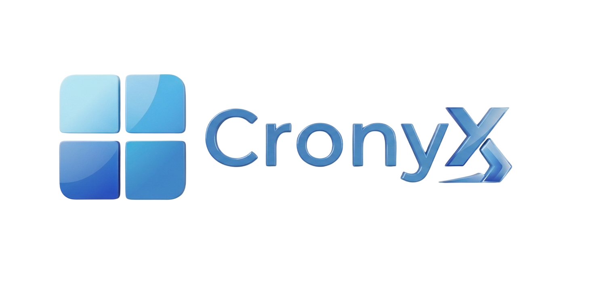

# CronyX 

**Run Windows (x86_64) applications on Android using Wine and Box86/Box64**

---

## 📋 Table of Contents

- [Installation](#-installation)
- [Community Tests](#-community-tests)
- [Useful Tips](#-useful-tips)
- [Project Information](#ℹ️-project-information)
- [Disclaimer / Support Policy](#️-disclaimer--support-policy)
- [Credits and Third-party Projects](#-credits-and-third-party-projects)

---

## 📥 Installation

1. Download the APK file (`CronyX.apk`) from the [GitHub Releases](https://github.com/REF4IK/winlator-ref4ik-/releases) page
2. Install the app on your device
3. Launch it and wait for the installation process to finish

> 💡 Allow installation from unknown sources in your Android settings if prompted.

---

## 🎬 Community Tests

Thank you to everyone who posts tests using my mods!

<table>
<tr>
<td></td>
<td></td>
</tr>
<tr>
<td></td>
<td></td>
</tr>
</table>

---

## 💡 Useful Tips

| Issue | Solution |
|---|---|
| 🐢 Performance drops | Switch the Box64 preset to `Performance` in **Container Settings → Advanced** |
| 🧩 .NET Framework apps | Install `Wine Mono` via **Start Menu → System Tools → Installers** |
| 🎮 Older games won't launch | Add the environment variable `MESA_EXTENSION_MAX_YEAR=2003` in **Container Settings → Environment Variables** |
| ⚙️ Per-game settings | Launch games via the shortcut on the Winlator home screen — you can define individual settings for each game there |
| 🖥️ Low-resolution games | Enable the `Force Fullscreen` option in the shortcut settings |
| 🕹️ Unity engine instability | Switch the Box64 preset to `Stability`, or add the `-force-gfx-direct` exec argument in the shortcut settings |

---

## ℹ️ Project Information

This project was originally based on the **Winlator Bionic** codebase by **[Pipetto-crypto](https://github.com/Pipetto-crypto/winlator)**, from mid-2025.

Since then, **ref4ik mod** has grown into an **independent project** — it develops its own original features while also integrating useful features from other Winlator-based projects, along with its own fixes and improvements. It is no longer a simple fork that mirrors upstream — it follows its own development path and release schedule.

---

## ⚠️ Disclaimer / Support Policy

- This project is built **entirely with the help of AI tools (neural networks)**.
- The app is tested on **one device only**. There is **no guarantee** that all features will work correctly on other devices, GPUs, or Android versions.
- **No official support and no obligation** to fix something that works on my device but not on yours. If a feature works on my device, it's not broken.
- Development happens **in my free time, not on a fixed schedule** — releases may be irregular and there's no guaranteed timeline.
- **Stability between versions is not guaranteed** — something that works in one version may break in the next, and rollbacks/fixes for older versions are not guaranteed either.

---

## 🙏 Credits and Third-party Projects

This project wouldn't be possible without the following developers and teams:

| Project | Author / Organization |
|---|---|
| Winlator | [brunodev85](https://github.com/brunodev85/winlator) |
| Winlator Bionic | [Pipetto-crypto](https://github.com/Pipetto-crypto/winlator/tree/dev) |
| Winlator Bionic Ludashi | [StevenMXZ](https://github.com/StevenMXZ/Winlator-Ludashi) |
| Winlator Cmod | [Coffincolors](https://github.com/coffincolors/winlator) |
| Bannerlator | [The412Banner/Bannerlator](https://github.com/The412Banner/Bannerlator) |
| WinNative | [WinNative Organization](https://github.com/WinNative-Emu) |
| GameNative | [Utkarshdalal](https://github.com/utkarshdalal/GameNative) |
| GLIBC Patches | [Termux Pacman](https://github.com/termux-pacman/glibc-packages) |
| Wine | [winehq.org](https://www.winehq.org/) |
| Wine Proton | [Valve Software](https://github.com/ValveSoftware/Proton) |
| Box86/Box64 | [ptitSeb](https://github.com/ptitSeb) |
| Mesa (Turnip/Zink/VirGL) | [mesa3d.org](https://www.mesa3d.org) |
| DXVK | [doitsujin/dxvk](https://github.com/doitsujin/dxvk) |
| VKD3D | [gitlab.winehq.org/wine/vkd3d](https://gitlab.winehq.org/wine/vkd3d) |
| D8VK | [AlpyneDreams/d8vk](https://github.com/AlpyneDreams/d8vk) |
| CNC DDraw | [FunkyFr3sh/cnc-ddraw](https://github.com/FunkyFr3sh/cnc-ddraw) |
| FEX-Emu | [FEX-Emu/FEX](https://github.com/FEX-Emu/FEX) |
| Leegao Wrapper | [leegao](https://github.com/leegao) |
| K11MCH1 Drivers | [K11MCH1/AdrenoToolsDrivers](https://github.com/K11MCH1/AdrenoToolsDrivers) |
| MrPurple666 Drivers | [MrPurple666/purple-turnip](https://github.com/MrPurple666/purple-turnip) |
| Weab-chan Drivers | [Weab-chan/freedreno_turnip-CI](https://github.com/Weab-chan/freedreno_turnip-CI) |
| StevenMXZ Drivers | [StevenMXZ/Adreno-Tools-Drivers](https://github.com/StevenMXZ/Adreno-Tools-Drivers) |

**Special thanks to all the developers involved in these projects, and to everyone who believes in this project. ❤️**

**And a huge thank you to every single user who downloads, plays with, tests, and supports this mod — you're the reason this project keeps moving forward. 🙌**

**Thanks as well to everyone who shares and posts about this mod on their channels, communities, and social media — it's what helps more people learn about the project. 📢**

