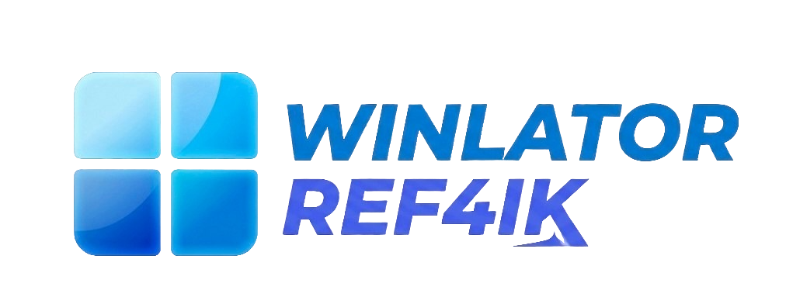

	

# Winlator ref4ik mod

### 🌐 Community

---
Winlator is an Android application that lets you to run Windows (x86_64) applications with Wine and Box86/Box64.

# Installation

1. Download and install the APK (Winlator.apk) from [GitHub Releases](https://github.com/REF4IK/winlator-ref4ik-/releases)
2. Launch the app and wait for the installation process to finish

----
# Community Tests

Thank you to everyone who posts tests using my mods!

----

# Useful Tips

- If you are experiencing performance issues, try changing the Box64 preset to `Performance` in Container Settings -> Advanced Tab.
- For applications that use .NET Framework, try installing `Wine Mono` found in Start Menu -> System Tools -> Installers.
- If some older games don't open, try adding the environment variable `MESA_EXTENSION_MAX_YEAR=2003` in Container Settings -> Environment Variables.
- Try running the games using the shortcut on the Winlator home screen, there you can define individual settings for each game.
- To display low resolution games correctly, try to enabling the `Force Fullscreen` option in the shortcut settings.
- To improve stability in games that uses Unity Engine, try changing the Box64 preset to `Stability` or in the shortcut settings add the exec argument `-force-gfx-direct`.

# Information

This project has been in constant development since version 1.0, the current app source code is up to version 7.1, I do not update this repository frequently precisely to avoid unofficial releases before the official releases of Winlator.

# Credits and Third-party apps
- Winlator by [brunodev85](https://github.com/brunodev85/winlator)
- Winlator Bionic by [Pipetto-crypto](https://github.com/Pipetto-crypto/winlator/tree/dev)
- Winlator Bionic Ludashi by [StevenMXZ](https://github.com/StevenMXZ/Winlator-Ludashi)
- Winlator Cmod by [Coffincolors](https://github.com/coffincolors/winlator)
- WinNative [Organization](https://github.com/WinNative-Emu)
- GameNative by [Utkarshdalal](https://github.com/utkarshdalal/GameNative)
- GLIBC Patches by [Termux Pacman](https://github.com/termux-pacman/glibc-packages)
- Wine ([winehq.org](https://www.winehq.org/))
- Wine Proton ([Valve Software](https://github.com/ValveSoftware/Proton?ysclid=mp95mv6qro575268615))
- Box86/Box64 by [ptitseb](https://github.com/ptitSeb)
- Mesa (Turnip/Zink/VirGL) ([mesa3d.org](https://www.mesa3d.org))
- DXVK ([github.com/doitsujin/dxvk](https://github.com/doitsujin/dxvk))
- VKD3D ([gitlab.winehq.org/wine/vkd3d](https://gitlab.winehq.org/wine/vkd3d))
- D8VK ([github.com/AlpyneDreams/d8vk](https://github.com/AlpyneDreams/d8vk))
- CNC DDraw ([github.com/FunkyFr3sh/cnc-ddraw](https://github.com/FunkyFr3sh/cnc-ddraw))
- FEX-Emu ([github.com/FEX-Emu/FEX](https://github.com/FEX-Emu/FEX))

Special thanks to all the developers involved in these projects. 

Thank you to all the people who believe in this project.
